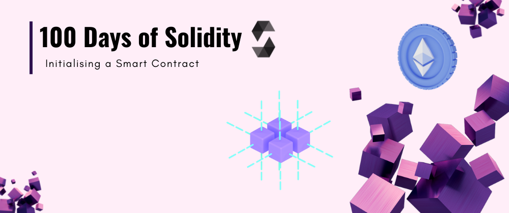

<div align="center">
  <h1> 100 Days Of Solidity: Initialising Basic Contract</h1>
  <a class="header-badge" target="_blank" href="https://dev.to/envoy_">
  
  </a>
  <a class="header-badge" target="_blank" href="https://twitter.com/Envoy_1084">
  
  </a>

<sub>Author:
<a href="https://dev.to/envoy_" target="_blank">Vedant Chainani</a><br>
<small> June, 2022</small>
</sub>
</div>

[<< Day 2](../Day%202%20-%20Comments/readme.md) | [Day 4 >>](../Day%204%20-%20Variables%20and%20Scopes/readme.md)



---

# 📔 Day 3

Smart contracts are simply programs stored on a blockchain that run when predetermined conditions are met. They typically are used to automate the execution of an agreement so that all participants can be immediately certain of the outcome, without any intermediary’s involvement or time loss. They can also automate a workflow, triggering the next action when conditions are met.

```solidity
contract ContractName {
    Statement1;
    Statement2;
}
```

It is Recommended to use Pascal case Notation for the Contract Name, you should capitalize first letter of each word in the contract name. eg -

```
MyContract
SendFunds
MintNft
```

---

[<< Day 2](../Day%202%20-%20Comments/readme.md) | [Day 4 >>](../Day%204%20-%20Variables%20and%20Scopes/readme.md)
